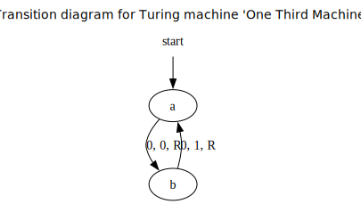

# TMLang

TMLang, which stands for Turing Machine Language, is a small language for designing and programming Turing machines.
It can, from a given machine:
 - Give the formal mathematical definition and the render the transition function as a table
 - Perform a computation from a given starting tape
 - Render the transition table as a state diagram, using `graphviz`

## Usage

The definition of a Turing machine used in TMLang is similar to the one on the [wikipedia page](https://en.wikipedia.org/wiki/Turing_machine).

### TMLang Syntax

Comments are written with `//`, and they must be in a separate line.
TMLang interprets the code line by line, so statements cannot be separated into several lines.
In TMLang, strings are written in two different ways: either with no quotation marks, or by using `''` to make it more clear.
Sets are written using curly brackets.

To create a Turing machine in TMLang, you first have to precise:
 - The machine's name, with the keyword `name`
 - The alphabet's blank (default) symbol with `blank`
 - The initial state, using `initial`
 - The set of final states (possibly empty), with `final`

Then, you write the transition function in this way:
 - You first use the keyword `startprog` to indicate you are starting the transition function
 - Then, the transition function is written line by line, ideally with some identation at the start of each line. The syntax is the following:
    - `old state, symbol read: new state, symbol to write, direction`
 - To end the transition function definition, use the keyword `endprogr`

When the Turing machine is completely defined, you can use it with the following commands:
 - `#printdef` to print the complete mathematical definition
 - `#run` to run the Turing machine from the starting tape precised, and print the final result of the computation
 - `#runsteps` does the same thing except it prints all intermediate steps as well
 - `#renderdiagram` renders the transition diagram to a file in the format precised (default: pdf)

#### Example

Here is an example of a simple TMLang program (it can be found in [examples/one_third_machine.tmlang](./examples/one_third_machine.tmlang)):

```
// Computes the sequence 0101010101010101..., which is 1/3 in binary

name 'One Third Machine'
initial a
final {}
blank 0


startprogr
    a, 0: b, 0, R
    b, 0: a, 1, R
endprogr


#printdef
#run ''
#renderdiagram svg
```

Ouput:

```
Turing machine 'One Third Machine' defined with:
* Set of states 𝙌 = {'a', 'b'}
* Initial state 𝙦₀ = 'a'
* Set of final/accepting states 𝙁 = ∅
* Alphabet 𝜞 = {'0', '1'} with blank symbol 𝑩 = '0'
* Transition function 𝛿 : (𝙌 ∖ 𝙁) × 𝙁 → 𝙌 × 𝙁 × {L, R, N}, represented as the following table:

┌───────────────┬────────────────┬────────────┬──────────────┬──────────────────┐
│ Current state │ Scanned symbol │ Next state │ Print symbol │ Moving direction │
├───────────────┼────────────────┼────────────┼──────────────┼──────────────────┤
│       a       │       0        │     b      │      0       │        R         │
│       b       │       0        │     a      │      1       │        R         │
└───────────────┴────────────────┴────────────┴──────────────┴──────────────────┘


---------------------------------------------------------------------------------------------------------------------------------------------------


The Turing machine seems to be caught in an infinite loop. After 200 steps, the tape is:
0101010101010101010101010101010101010101010101010101010101010101010101010101010101010101010101010101010101010101010101010101010101010101010101010101010101010101010101010101010101010101010101010101010
                                                                                                                                                                                                      ^


---------------------------------------------------------------------------------------------------------------------------------------------------


Transition diagram rendered as svg to file 'transition_diagram_One_Third_Machine.svg'
```

transition_diagram_One_Third_Machine.svg (other examples of images rendered can be found in [images](./images/) folder):




### CLI Progam

To execute a TMLang Turing machine, the command line interpreter ([TMLang.py](./src/TMLang.py)) can be used.
```
usage: TMLang.py [-h] [-o OUTPUT] [-v] [-a] filename

A small language for designing and programming Turing machines

positional arguments:
  filename             the path to the file containing the code to interpret

options:
  -h, --help           show this help message and exit
  -o, --output OUTPUT  the file to write the generated output (default: stdout)
  -v, --verify         if used, the output is printed only in case of error in the program given
  -a, --auto-open      when rendering a transition diagram, the program will automatically the generated image
```


## Dependencies

 - `prettytable` used for displaying transition tables
 - `graphviz` used for rendering graphical transition diagrams

 `black` was used for code formatting