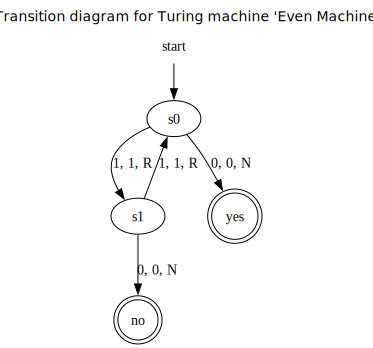

# TMLang

TMLang, which stands for Turing Machine Language, is a small language for designing and programming Turing machines.
It can, from a given machine:
 - Give the formal mathematical definition and the render the transition function as a table
 - Perform a computation from a given starting tape
 - Render the transition table as a state diagram, using `graphviz`

## Usage

The definition of a Turing machine used in TMLang is similar to the one on the [wikipedia page](https://en.wikipedia.org/wiki/Turing_machine).

### TMLang Syntax

Comments are written with `//` (inline comments are supported).
TMLang interprets the code line by line, so statements cannot be separated into several lines.
In TMLang, strings are written in two different ways: either with no quotation marks, or by using `''` to make it more clear.
Sets are written using curly brackets (normal set syntax).

To create a Turing machine in TMLang, you first have to precise:
 - The machine's name, with the keyword `name`
 - The alphabet's blank (default) symbol with `blank`
 - The initial state, using `initial`
 - The set of final states (possibly empty), with `final`

Then, you write the transition function in this way:
 - You first use the keyword `startprog` to indicate the start of the transition function
 - Then, the transition function is written line by line, with some identation at the start of each line. The syntax is the following:
    - `old state, symbol read: new state, symbol to write, direction`
 - To end the transition function definition, use the keyword `endprogr`

When the Turing machine is completely defined, you can use it with the following commands:
 - `#printdef` to print the complete mathematical definition, along with the transition table
 - `#run` to run the Turing machine from the starting tape precised, and print the final result of the computation
 - `#runsteps` does the same thing except it prints all intermediate steps as well
 - `#renderdiagram` renders the transition diagram to a file in the format precised (default: pdf)

#### Example

Here is an example of a simple TMLang program (it can be found in [examples/even_machine.tmlang](./examples/even_machine.tmlang)):

```
// Calculates if a unary sequence of 1's on the starting tape is even or not
// Halts on state 'yes' if even and on state 'no' otherwise

name 'Even Machine'
blank 0
initial s0
final {yes, no}

startprogr
    s0, 1: s1, 1, R
    s1, 1: s0, 1, R
    s0, 0: yes, 0, N
    s1, 0: no, 0, N
endprogr


#printdef
#run '111'
#renderdiagram
```

Ouput:

```
Turing machine 'Even Machine' defined with:
* Set of states 𝙌 = {'yes', 'no', 's1', 's0'}
* Initial state 𝙦₀ = 's0'
* Set of final/accepting states 𝙁 = {'no', 'yes'}
* Alphabet 𝜞 = {'1', '0'} with blank symbol 𝑩 = '0'
* Transition function 𝛿 : (𝙌 ∖ 𝙁) × 𝙁 → 𝙌 × 𝙁 × {L, R, N}, represented as the following table:

┌───────────────┬────────────────┬────────────┬──────────────┬──────────────────┐
│ Current state │ Scanned symbol │ Next state │ Print symbol │ Moving direction │
├───────────────┼────────────────┼────────────┼──────────────┼──────────────────┤
│       s0      │       1        │     s1     │      1       │        R         │
│       s1      │       1        │     s0     │      1       │        R         │
│       s0      │       0        │    yes     │      0       │        N         │
│       s1      │       0        │     no     │      0       │        N         │
└───────────────┴────────────────┴────────────┴──────────────┴──────────────────┘


───────────────────────────────────────────────────────────────────────────────────────────────────────────────────────────────────────────────────


Turing machine 'Even Machine' halted on state 'no' from input '111' after 5 steps, with final tape:
1110
   ^


───────────────────────────────────────────────────────────────────────────────────────────────────────────────────────────────────────────────────


Transition diagram rendered as svg to file 'transition_diagram_Even_Machine.svg'
```

transition_diagram_Even_Machine.svg (other examples of images rendered can be found in [images](./images/)):




### CLI Progam

To interpret a TMLang Turing machine, the command line interpreter ([TMLang.py](./src/TMLang.py)) can be used.
```
usage: TMLang.py [-h] [-o OUTPUT] [-v] [-a] filename

A small language for designing and programming Turing machines

positional arguments:
  filename             the path to the file containing the code to interpret

options:
  -h, --help           show this help message and exit
  -o, --output OUTPUT  the file to write the generated output (default: stdout)
  -v, --verify         if used, the output is printed only in case of error in the program given
  -a, --auto-open      when rendering a transition diagram, the program will automatically open the generated image
```


## Dependencies

 - `prettytable` used for displaying transition tables
 - `graphviz` used for rendering graphical transition diagrams

`black` was used for code formatting